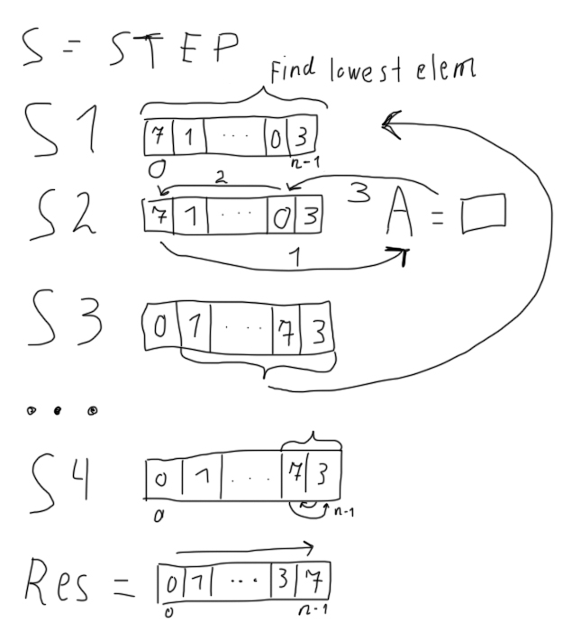

<p align="center"><b>МОНУ НТУУ КПІ ім. Ігоря Сікорського ФПМ СПіСКС</b></p>

<p align="center">
<b>Звіт з лабораторної роботи 3</b><br/>
"Функціональний і імперативний підходи до роботи зі списками"<br/>
дисципліни "Вступ до функціонального програмування"
</p>

<p align="right"><b>Студент</b>: Мануйлов Денис Денисович</p>
<p align="right"><b>Рік</b>: 2025</p>

## Загальне завдання
Реалізуйте алгоритм сортування чисел у списку двома способами: функціонально і
імперативно.
1. Функціональний варіант реалізації має базуватись на використанні рекурсії і
конструюванні нових списків щоразу, коли необхідно виконати зміну вхідного
списку. Не допускається використання: псевдо-функцій, деструктивних операцій,
циклів . Також реалізована функція не має бути функціоналом (тобто приймати на
вхід функції в якості аргументів).  
2. Імперативний варіант реалізації має базуватись на використанні циклів і
деструктивних функцій (псевдофункцій). Не допускається використання функцій
вищого порядку або функцій для роботи зі списками/послідовностями, що
використовуються як функції вищого порядку. Тим не менш, оригінальний список
цей варіант реалізації також не має змінювати, тому перед виконанням
деструктивних змін варто застосувати функцію copy-list (в разі необхідності).
Також реалізована функція не має бути функціоналом (тобто приймати на вхід
функції в якості аргументів).

## Варіант 11(11 % 5 = 1)
Алгоритм сортування вибором за незменшенням.

<p align="center">

</p>

## Лістинг функції FchoiseSort (Функціональний варіант)
```Lisp
(defun remove-first (elem lst)
  (if (eql elem (car lst))
      (cdr lst)
      (cons (car lst) (remove-first elem (cdr lst)))))

(defun findMinElem (elem lst)
  (cond
    ((null lst) elem)
    ((> elem (car lst)) (findMinElem (car lst) (cdr lst)))
    (t (findMinElem elem (cdr lst)))))

(defun FchoiseSort (lst)
  (if (null (cdr lst))
    lst
    (let* ((min (findMinElem (car lst) (cdr lst)))
          (restList (remove-first min lst)))
      (cons min (FchoiseSort restList)))))
```

## Лістинг функції IchoiseSort (Імперативний варіант)
```lisp
(defun IchoiseSort (lst)
  (let ((lst-copy (copy-list lst)))    
    (do ((lst-right lst-copy (cdr lst-right)))
        ((null (cdr lst-right)))      
      (let ((min-elem lst-right))
        (do ((lst-for-search (cdr lst-right) (cdr lst-for-search)))
            ((null lst-for-search))
          (when (> (car min-elem) (car lst-for-search))
                 (setf min-elem lst-for-search)))
        (rotatef (car lst-right) (car min-elem))))      
    lst-copy))
```

### Тестові набори та утиліти
```lisp
(defun check-choiseSort (name input expected)
  "Execute sort function on `input`, compare result with `expected` and print comparison status"
  (format t "~:[FAILED~;passed~] ~a~%"

          ;; --- Виклик для функціональної версії (FchoiseSort) ---
          ;(equal (FchoiseSort input) expected)

          ;; --- Виклик для ітеративної версії (IchoiseSort) ---
          (equal (IchoiseSort input) expected)

          name))

(defun test-choiseSort ()
  (check-choiseSort "test 1" '(5 3 1 2 4) '(1 2 3 4 5))
  (check-choiseSort "test 2" '(10 9 8 7 6 5) '(5 6 7 8 9 10))
  (check-choiseSort "test 3" '(1 2 3 4 5) '(1 2 3 4 5))
  (check-choiseSort "test 4" '(3) '(3))
  (check-choiseSort "test 5" '() '()))
```

### Тестування
FchoiseSort (Функціональний варіант)
```lisp
CL-USER> (test-choiseSort)
passed test 1
passed test 2
passed test 3
passed test 4
passed test 5
NIL
```
IchoiseSort (Імперативний варіант)
```lisp
CL-USER> (test-choiseSort)
passed test 1
passed test 2
passed test 3
passed test 4
passed test 5
NIL
```
